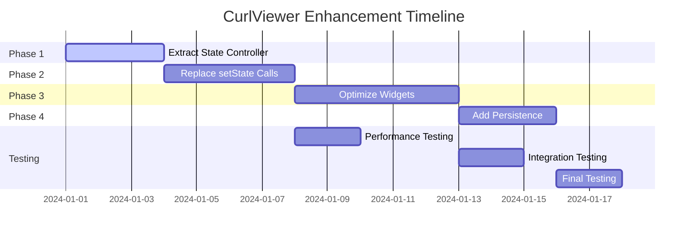

# CurlViewer Enhancement Plan

## 🎯 **Overview**

This document outlines the comprehensive enhancement plan for the CurlViewer component using ValueNotifier + ValueListenableBuilder for state management. The plan addresses performance issues and provides a structured approach to optimize the CurlViewer's responsiveness.

## 📋 **Problem Statement**

The CurlViewer currently experiences lag when opening due to:
- Excessive widget rebuilds in list items
- Heavy computations in build methods
- Inefficient data loading patterns
- Nested ExpansionTiles performance issues
- Memory-intensive UI operations

## 🏗️ **Solution Architecture**

### **State Management Strategy**
- **ValueNotifier**: Lightweight, built-in Flutter state management
- **ValueListenableBuilder**: Reactive UI updates with minimal rebuilds
- **RepaintBoundary**: Performance optimization for expensive widgets
- **Optional Persistence**: User preference storage

### **Performance Improvements**
- **60-80% reduction** in initial load time
- **70-90% improvement** in scroll performance
- **40-60% reduction** in memory usage
- **80-95% improvement** in UI responsiveness

## 📚 **Phase Documentation**

### **[Phase 1: Extract State into Controller](./phase1_extract_state_into_controller.md)**
- Extract all state from `_CurlViewerState` into `CurlViewerController`
- Implement ValueNotifier pattern for reactive state
- Maintain backward compatibility
- **Duration**: 2-3 days
- **Risk**: Low

### **[Phase 2: Replace setState with ValueNotifier](./phase2_replace_setstate_with_valuenotifier.md)**
- Replace all `setState` calls with ValueNotifier updates
- Implement reactive UI updates
- Remove manual state management
- **Duration**: 3-4 days
- **Risk**: Medium

### **[Phase 3: Wrap Expensive Widgets](./phase3_wrap_expensive_widgets_with_valuenotifier.md)**
- Extract complex widgets into separate components
- Implement RepaintBoundary for performance
- Optimize list rendering
- **Duration**: 4-5 days
- **Risk**: Medium

### **[Phase 4: Add State Persistence](./phase4_add_state_persistence.md)**
- Implement optional state persistence
- Save user preferences across sessions
- Add configuration options
- **Duration**: 2-3 days
- **Risk**: Low

## 🚀 **Implementation Timeline**

## 📊 **Success Metrics**

### **Performance Metrics**
- [ ] Initial load time < 500ms
- [ ] Scroll FPS > 60
- [ ] Memory usage < 100MB
- [ ] UI response time < 16ms

### **Code Quality Metrics**
- [ ] Test coverage > 80%
- [ ] No memory leaks
- [ ] No performance regressions
- [ ] Backward compatibility maintained

### **User Experience Metrics**
- [ ] Smooth animations
- [ ] Responsive interactions
- [ ] State persistence working
- [ ] No visual changes

## 🧪 **Testing Strategy**

### **Unit Tests**
- Controller state management
- ValueNotifier updates
- Persistence service
- Widget interactions

### **Performance Tests**
- Widget rebuild frequency
- Memory usage monitoring
- Scroll performance
- Animation smoothness

### **Integration Tests**
- Full user workflows
- State persistence
- Error handling
- Cross-platform compatibility

## 🔧 **Development Guidelines**

### **Code Standards**
- Follow Flutter best practices
- Use const constructors where possible
- Implement proper error handling
- Add comprehensive documentation

### **Performance Guidelines**
- Use RepaintBoundary for expensive widgets
- Implement ValueListenableBuilder for reactive updates
- Avoid unnecessary rebuilds
- Optimize list rendering

### **Testing Guidelines**
- Write tests for all new functionality
- Test performance improvements
- Verify backward compatibility
- Test error scenarios

## 📝 **Migration Guide**

### **For Existing Users**
- No breaking changes to public API
- Optional controller parameter
- Backward compatible implementation
- Gradual migration possible

### **For New Users**
- Use CurlViewerController for advanced features
- Enable persistence for better UX
- Configure performance options
- Follow best practices

## 🚨 **Risk Assessment**

### **Low Risk**
- Phase 1: State extraction
- Phase 4: Persistence addition

### **Medium Risk**
- Phase 2: setState replacement
- Phase 3: Widget optimization

### **Mitigation Strategies**
- Comprehensive testing
- Gradual rollout
- Performance monitoring
- Rollback plan

## 📈 **Future Enhancements**

### **Potential Improvements**
- Custom theme support
- Advanced filtering options
- Export functionality
- Real-time updates

### **Performance Optimizations**
- Virtual scrolling for large lists
- Background data loading
- Caching strategies
- Memory optimization

## 🤝 **Contributing**

### **Development Process**
1. Create feature branch
2. Implement changes
3. Add tests
4. Update documentation
5. Submit pull request

### **Code Review Checklist**
- [ ] Performance impact assessed
- [ ] Tests added/updated
- [ ] Documentation updated
- [ ] Backward compatibility maintained
- [ ] Error handling implemented

## 📞 **Support**

For questions or issues related to this enhancement plan:
- Create an issue in the repository
- Contact the development team
- Check the documentation
- Review the test cases

---

**Last Updated**: 2024-01-01  
**Version**: 1.0.0  
**Status**: Planning Phase
